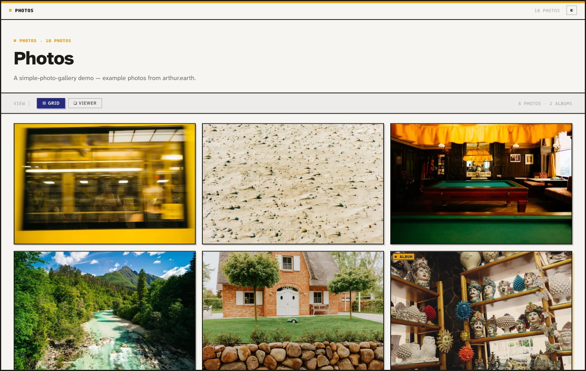
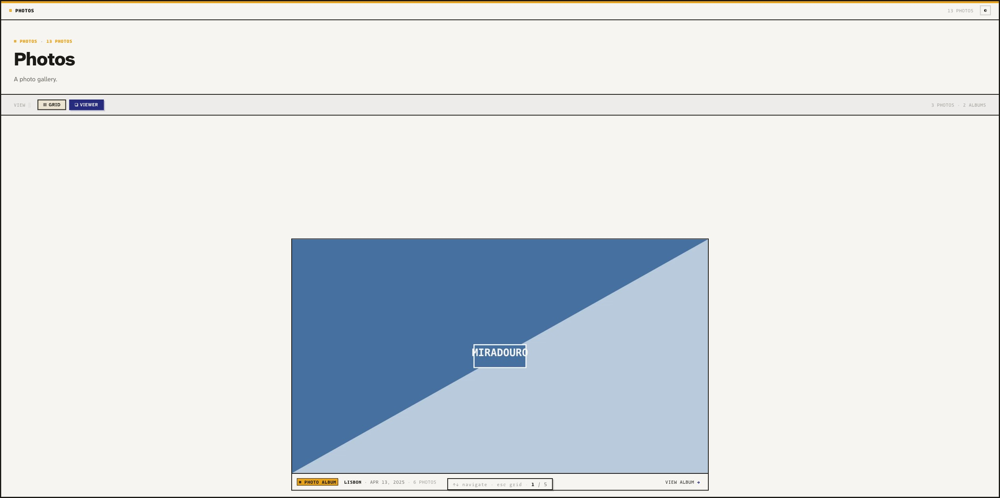
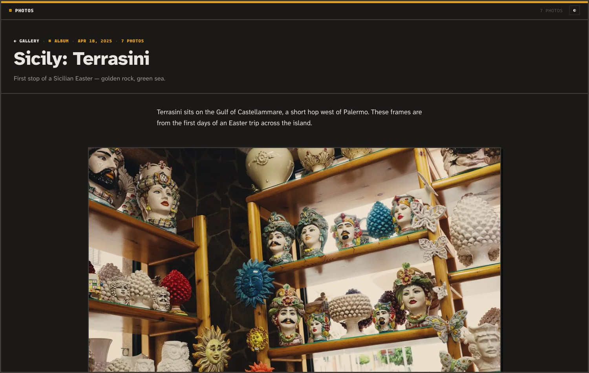
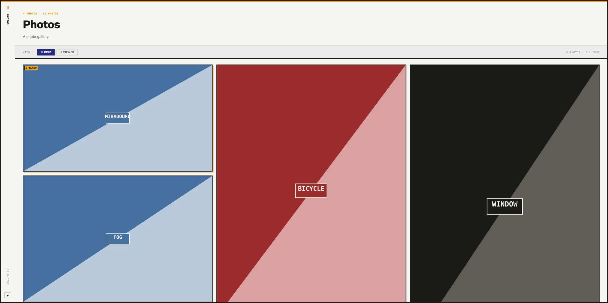
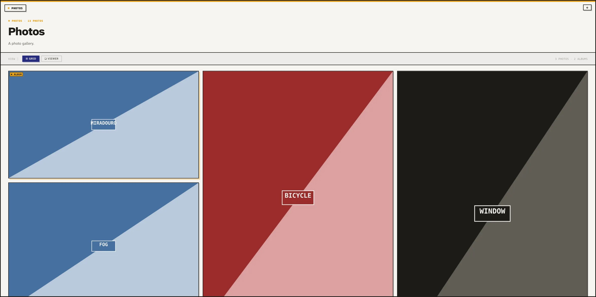

# simple-photo-gallery

A fork-and-deploy photo gallery for **Astro + GitHub Pages**. Drop photos in
a folder, push, and get a fast static gallery with a Modern-TUI look — hard
edges, solid shadows, terminal-inspired chrome. Masonry **Grid**, full-bleed
**Viewer** with keyboard navigation and deep links, photo-essay album pages
with a lightbox, EXIF-driven captions, and build-time image optimization.

**Live demo:** <https://arthursoares.github.io/simple-photo-gallery/>
(example photos from [arthur.earth](https://arthur.earth))

| Gallery index | Viewer mode | Album page (dark) |
| --- | --- | --- |
|  |  |  |

## Deploy your own in three steps

1. **Fork** (or "Use this template") this repository.
2. In your fork: **Settings → Pages → Build and deployment → Source →
   "GitHub Actions"**. That's the only manual setting.
3. Replace the contents of `src/content/photos/` with your photos, edit
   `gallery.config.ts` (title, author), commit, push to `main`.

The included workflow (`.github/workflows/deploy.yml`) builds and publishes
on every push. It auto-detects your Pages URL — user site, project site
(`/<repo>/`), or custom domain — no config edits needed.

Run locally with:

```bash
npm install
npm run dev        # http://localhost:4321
```

No photos yet? `npm run demo` generates placeholders (with EXIF) to play with.

## Content model: folders are albums, files are photos

```
src/content/photos/
├── sicily-terrasini/        ← a folder = an album → /sicily-terrasini/
│   ├── index.md             ← optional: title, date, writeup, captions, order
│   ├── L1001235.jpg
│   └── …
├── snow.jpg                 ← a loose file = a single photo
├── snow.md                  ← optional sidecar (same basename)
└── 2025-03-08-bicycle.jpg   ← date parsed from the filename
```

Everything works with **zero metadata** — drop photos, get a site. Markdown
adds control where you want it:

```yaml
# <album>/index.md
---
title: "Sicily: Terrasini"
date: 2025-04-18
caption: First stop of a Sicilian Easter.   # album excerpt
cover: L1001243.jpg          # index thumbnail (default: first photo)
draft: false                 # hide the whole album
tags: [travel, sicily]
photos:                      # explicit order — wins over everything;
  - file: L1001243.jpg       # entries may carry per-photo captions
    caption: The Terrasini coastline
  - file: L1001235.jpg
---
The markdown body is the album writeup, shown above the photos.
```

A photo's sidecar (`snow.md`, also next to images inside album folders) takes
`title`, `caption`, `alt`, `date`, `tags`, `draft`.

### Entry pages (about, colophon, imprint…)

Markdown files in `src/content/pages/` become standalone pages at
`/<filename>/`, rendered in the documentation style and linked from the site
menu automatically (the demo's [About page](https://arthursoares.github.io/simple-photo-gallery/about/)
is one). Frontmatter: `title`, `description`, `mark` (kick-line glyph),
`nav`/`navLabel`/`order` (menu visibility, label, position), `draft`. The
body is standard markdown — GFM tables, code blocks, inline HTML. Menu order
is entry pages first, then the manual `nav` links from `gallery.config.ts`;
for fully custom pages, write an `.astro` file in `src/pages/` instead (the
demo's `/docs/` page is built that way).

### Ordering

Per album (and for loose photos), the first applicable source wins:

1. **`photos:` list** in `index.md` — curation beats everything; unlisted
   files are appended after, in automatic order.
2. **Numeric filename prefix** — `01-…`, `02-…` (the export convention).
3. **EXIF `DateTimeOriginal`** — chronological shooting order.
4. **Date in the filename** — `YYYY-MM-DD-…`, for EXIF-stripped files.
5. **Filename**, alphabetical — deterministic fallback.

The gallery index sorts items (singles + albums) newest-first; an album's
date is its `date:` frontmatter, else its newest photo.

### EXIF

Read at build time (via `exifr`) — nothing ships to the client:

- **Ordering & dates** — `DateTimeOriginal` (see above).
- **Naming** — markdown title → XMP/IPTC title → humanized filename.
  Captions fall back to EXIF `ImageDescription`.
- **Tags** — frontmatter `tags` ∪ IPTC/XMP keywords.
- **Caption templates** — see below.

(The demo-site example photos were re-compressed by a CDN that strips EXIF,
so their metadata comes from the markdown layer — both paths are first-class.)

## Configuration — `gallery.config.ts`

One file controls the site:

```ts
export default {
  title: 'Photos',           // chrome title, <title>, page header
  description: '…',          // meta description + header excerpt
  author: '…',

  mode: 'auto',              // 'gallery' | 'single' | 'auto'
                             // auto: exactly one album & no loose photos → single
  presentation: 'grid',      // single mode: 'grid' (Grid ⇄ Viewer) | 'essay'
  chrome: 'header',          // 'header' | 'rail' | 'frame' (see below)
  mobileNav: 'kebab',        // phone menu: 'kebab' (⋮ dropdown) | 'inline' (scrolling links)

  // Captions are assembled from templates. Tokens: {title} {caption} {date}
  // {camera} {lens} {focal} {aperture} {shutter} {iso} {keywords}.
  // Split on '·' — a segment whose tokens all resolve empty is dropped,
  // so missing EXIF degrades gracefully.
  captionTemplate: '{title} · {date} · {caption}',
  exifTemplate: '{camera} · {focal} · {aperture} · {shutter} · ISO {iso}',

  dateFormat: { month: 'short', day: '2-digit', year: 'numeric' },
  locale: 'en-US',

  // Image optimization: the renditions generated at build time.
  images: {
    thumb:  { widths: [200, 400, 750],   sizes: '(min-width: 768px) 280px, 50vw' },
    viewer: { widths: [750, 1140, 1920], sizes: '(min-width: 768px) min(1100px, 92vw), 94vw' },
    full:   { width: 2000 },             // lightbox / "full ↗" links
    quality: 80,
  },
};
```

### Site modes

- **gallery** — `/` is the index (Grid ⇄ Viewer over singles + album
  covers), each album gets `/<album>/` with writeup + photo essay + lightbox.
- **single** — the whole site is one album (a trip, a wedding, an event):
  `/` renders it directly, as `grid` or as an `essay`.

### Chrome variants

| `header` | `rail` | `frame` |
| --- | --- | --- |
|  |  |  |

All variants keep the fixed app-frame border, the amber top stripe,
persisted light/dark mode (warm near-black, follows the OS by default), and
the `░▒▓ EOF ▓▒░` flourish.

## Image optimization

Commit full-resolution sources; sharp (via `astro:assets`) generates the
configured renditions at build time as WebP, skipping any width larger than
the source. Thumbnails, viewer frames, and the lightbox each get their own
size set (`images` in the config). Want different trade-offs? Change the
widths/quality and push — the workflow rebuilds everything.

## Interaction

- **Grid** — row-first masonry (reads left→right, packs vertically). Albums
  show a `▣ Album` pill + amber pop shadow and link to their page; single
  photos open the Viewer in place.
- **Viewer** — one photo per screen, normal scrolling. `← → ↑ ↓ / j k /
  Home / End` jump photo-to-photo, `Esc` returns to the grid. The current
  photo's slug is reflected in the URL — `/#<slug>` deep-links work.
- **Album pages** — writeup + photo-essay feed; clicking a photo opens the
  lightbox (same keys, `Esc` closes, swipe on touch) at the full rendition.

## Customizing & extending

- Colors, spacing, typography: design tokens in `src/styles/tokens.css`
  (light + dark). Components consume tokens only.
- Fonts: Atkinson Hyperlegible Next ships with the repo (freely licensed);
  the mono face falls back to your system stack. Add `.woff2` files to
  `src/assets/fonts/` + `@font-face` rules in `src/styles/fonts.css`.
- Working with an AI coding agent? **`AGENTS.md`** documents the
  architecture, configuration semantics, gotchas, and extension recipes
  (new chrome variants, caption tokens, tag pages, extra pages).

## License

Code is MIT. The example photographs are © [Arthur Soares](https://arthur.earth)
and are **not** MIT — replace them with your own when forking. See `LICENSE`.
