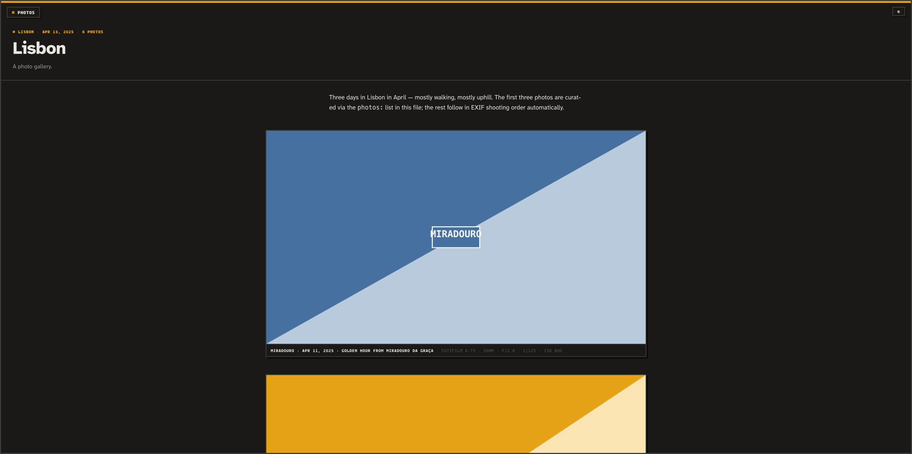

# artsoares-photo-gallery

A Modern-TUI photo gallery theme for [Astro](https://astro.build). Hard edges,
solid shadows, terminal-inspired chrome — masonry **Grid**, full-bleed
**Viewer** with keyboard navigation and deep links, photo-essay album pages
with a lightbox, and EXIF-driven captions, naming, and tags.

Two site shapes from one codebase:

- **gallery** — a multi-photo / multi-album site: `/` is the gallery index,
  each album gets its own page at `/<album>/`.
- **single** — the whole site is one album (a trip, a wedding, an event):
  `/` renders it directly, as either the Grid ⇄ Viewer experience or a
  scrolling photo essay.

| Gallery index (header chrome) | Viewer mode | Single-mode essay (dark) |
| --- | --- | --- |
|  |  |  |

## Quick start

```bash
npm install
npm run demo    # generate placeholder photos with EXIF (optional)
npm run dev
```

Then drop your photos into `src/content/photos/` and delete the demo ones.

## Content model: folders are albums, files are photos

```
src/content/photos/
├── 2025-04-lisbon/          ← a folder = an album
│   ├── index.md             ← optional: title, date, writeup, captions, order
│   ├── alfama-steps.jpg
│   └── tram-28.jpg
├── rooftop-fog.jpg          ← a loose file = a single photo
├── rooftop-fog.md           ← optional sidecar (same basename)
└── 2025-03-08-red-bicycle.jpg   ← date parsed from the filename
```

Everything works with **zero metadata** — drop photos, get a site. Markdown
adds control where you want it:

```yaml
# <album>/index.md
---
title: Lisbon
date: 2025-04-13
caption: Three days of hills, tiles, and hard light.   # album excerpt
cover: miradouro.jpg          # index thumbnail (default: first photo)
draft: false                  # hide the whole album
tags: [travel, city]
photos:                       # explicit order — wins over everything;
  - file: miradouro.jpg       # also carries per-photo captions
    caption: Golden hour from Miradouro da Graça
  - file: tram-28.jpg
---
The markdown body is the album writeup, shown above the photos.
```

A loose photo's sidecar (`rooftop-fog.md`) takes `title`, `caption`, `alt`,
`date`, `tags`, `draft`.

## Ordering

Per album (and for loose photos), the first applicable source wins:

1. **`photos:` list** in `index.md` — curation beats everything; unlisted
   files are appended after, in automatic order.
2. **Numeric filename prefix** — `01-…`, `02-…` (the export convention).
3. **EXIF `DateTimeOriginal`** — chronological shooting order.
4. **Date in the filename** — `YYYY-MM-DD-…`, for EXIF-stripped files.
5. **Filename**, alphabetical — deterministic fallback.

The gallery index sorts items (singles + albums) newest-first; an album's
date is its `date:` frontmatter, else its newest photo.

## EXIF

Read at build time (via `exifr`) — nothing ships to the client:

- **Ordering & dates** — `DateTimeOriginal` (see above).
- **Naming** — per photo: sidecar/`index.md` title → XMP/IPTC title →
  humanized filename. Captions: explicit caption → EXIF `ImageDescription`.
- **Tags** — frontmatter `tags` ∪ IPTC/XMP keywords.
- **Caption templates** — captions are assembled from a template with
  EXIF tokens (see below).

## Configuration — `gallery.config.ts`

```ts
export default {
  title: 'Photos',
  description: 'A photo gallery.',

  mode: 'auto',          // 'gallery' | 'single' | 'auto'
                         // auto: exactly one album & no loose photos → single
  presentation: 'grid',  // single mode: 'grid' (Grid ⇄ Viewer) | 'essay'
  chrome: 'header',      // 'header' | 'rail' | 'frame' (see below)

  // Tokens: {title} {caption} {date} {camera} {lens} {focal} {aperture}
  // {shutter} {iso} {keywords}. Split on '·' — a segment whose tokens all
  // resolve empty is dropped, so missing EXIF degrades gracefully.
  captionTemplate: '{title} · {date} · {caption}',
  exifTemplate: '{camera} · {focal} · {aperture} · {shutter} · ISO {iso}',

  dateFormat: { month: 'short', day: '2-digit', year: 'numeric' },
  locale: 'en-US',
};
```

### Chrome variants

| `header` | `rail` | `frame` |
| --- | --- | --- |
|  |  |  |

- **header** — slim top bar: mark · title · photo count · theme toggle.
- **rail** — narrow left rail with a vertical title (folds into a top bar
  on phones).
- **frame** — no bar; a floating title chip and theme toggle sit in the
  app-frame corners. Most "gallery-as-artifact".

All variants keep the fixed app-frame border, the amber top stripe, light/dark
mode (warm near-black, persisted, follows the OS by default), and the
`░▒▓ EOF ▓▒░` flourish.

## Interaction

- **Grid** — row-first masonry (reads left→right, packs vertically). Albums
  show a `▣ Album` pill + amber pop shadow and link to their page; single
  photos open the Viewer in place.
- **Viewer** — one photo per screen, normal scrolling. `← → ↑ ↓ / j k /
  Home / End` jump photo-to-photo, `Esc` returns to the grid. The current
  photo's slug is reflected in the URL: `/#<slug>` deep-links work.
- **Album pages** — writeup + photo-essay feed; clicking a photo opens the
  **lightbox** (same keys, `Esc` closes, swipe on touch), which shows the
  ~2000px rendition.

## Images

Sources can be full-resolution; `astro:assets`/sharp generates responsive
renditions at build time (thumbnails ≤750w, viewer ≤1920w, lightbox ≤2000w).
Static output — deploy the `dist/` folder anywhere.

## Fonts

Atkinson Hyperlegible Next ships with the repo (freely licensed). The mono
face falls back to the system mono stack; to use Divenire Mono (or any other
mono), drop licensed `.woff2` files into `public/fonts/` and add `@font-face`
rules in `src/styles/fonts.css` — the `--font-mono` token already lists it
first.

## Provenance

Extracted from the gallery system of the "Braun" Ghost theme (Modern TUI
design system) and rebuilt on Astro content collections.
